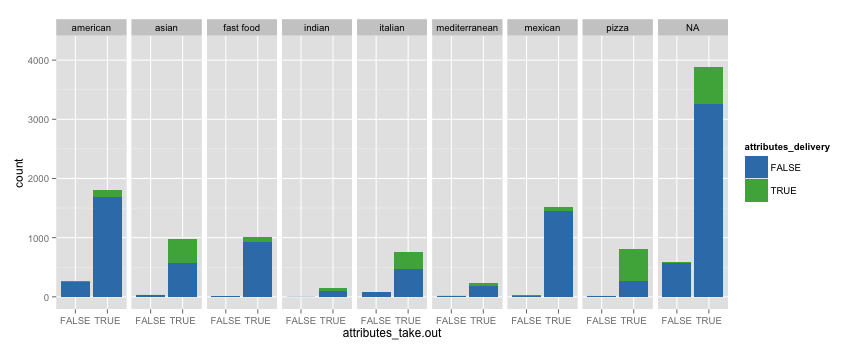
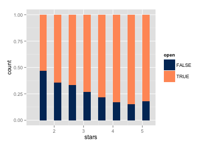

```{r echo=FALSE}
suppressPackageStartupMessages(require(dplyr))
suppressPackageStartupMessages(require(googleVis))
suppressPackageStartupMessages(require(wordcloud))
suppressPackageStartupMessages(require(tm))
suppressPackageStartupMessages(require(ggplot2))
food <- read.csv("/Users/marianwaitwalsh/Github/STAT-579-Final-Project/Data/Restaurants/food.csv")
tips <- read.csv("/Users/marianwaitwalsh/Github/STAT-579-Final-Project/Data/Restaurants/tips.csv")
```

## Intro

## Schedule {.smaller}

Our presentation will procede as follows:

> - Brief description of data
> - Restaurants
>     + The cost of reservations
>     + Loud can be good, but not too loud
>     + It's all about service
>     + Delivery vs. takeout
> - Bars
>     + Food
>     + Stars
>     + Popular features
> - Hotels
> - Shopping

# Data

## Raw data format

Words

## Data cleaning process | Subtitle


# Restaurants

----

```{r, echo=FALSE}
shinyApp(
  ui = fluidPage(responsive = FALSE, 
                 fluidRow(style = "padding-bottom: 20px;",
                  column(2, selectInput("place", label = "Region", 
                            levels(food$state), selected = "WI")),
                  column(4, selectInput("type", label = "Type",
                            choices = levels(food$type), 
                            selected = levels(food$type)[1],
                            multiple = TRUE)),
                  column(2, selectInput("hour", label = "Hour",
                            choices = c("All", "Breakfast",
                                        "Lunch", "Dinner"),
                            selected = "All")),
                  column(2, selectInput("lower", label = "Rating low",
                            choices = as.character(seq(1,5, by=0.5)),
                            selected = "4")),
                  column(2, selectInput("upper", label = "Rating high",
                            choices = as.character(seq(1,5,by=0.5)),
                            selected = "5"))),
                 htmlOutput("map")
                 ),
  
  server = function(input, output) {
    dataInput <- reactive({      
      if (input$hour == "Breakfast") {
        df <- food %>% subset(state == input$place, stars > 4) %>%
          filter(type %in% input$type) %>%
          filter(stars >= as.numeric(input$lower) & 
                   stars <= as.numeric(input$upper))
        df <- df[grep("breakfast': True", df$attributes_good.for),]
      }      
      else if (input$hour == "Lunch") {
        df <- food %>% subset(state == input$place, stars > 4) %>%
          filter(type %in% input$type) %>%
          filter(stars >= as.numeric(input$lower) & 
                   stars <= as.numeric(input$upper))
        df <- df[grep("lunch': True", df$attributes_good.for),]
      }      
      else if (input$hour == "Dinner") {
        df <- food %>% subset(state == input$place, stars > 4) %>%
          filter(type %in% input$type) %>%
          filter(stars >= as.numeric(input$lower) & 
                   stars <= as.numeric(input$upper))
        df <- df[grep("dinner': True", df$attributes_good.for),]
      }      
      else {
      df <- food %>% subset(state == input$place, stars > 4) %>%
        filter(type %in% input$type) %>%
        filter(stars >= as.numeric(input$lower) & 
                 stars <= as.numeric(input$upper))        
      }
    })
    
    output$map <- renderGvis({
      gvis1 <- gvisMap(dataInput(), "location", "tip",
                 options = list(showTip = TRUE, 
                                enableScrollWheel = TRUE,
                                useMapTypeControl = TRUE,
                                mapType = "normal"))
      gvis1
    })
  }
)
```

## The cost of reservations {.flexbox .vcenter}

The relationship of price and reservations


## The cost of reservations {.flexbox .vcenter}

The effect on stars of reservations


## Noise pollution {.flexbox .vcenter}

Loud can be good, but never too loud


## It's all about service

```{r echo=FALSE}
shinyApp(
  ui = fluidPage(responsive = FALSE,
    fluidRow(
      sidebarPanel(
        selectInput("category", "Category:", 
                    choices = c("More than 4 stars", "Less than 2 stars"), 
                    selected = "More than 4 stars"),
        sliderInput("n", "Sample size:", min = 300, 
                  max = 1000, value = 600, step = 10),
        submitButton("Draw"),
        br(),
        conditionalPanel(
         condition = "input.n > 686 & input.category == 'Less than 2 stars'",
         helpText("Note: there are only 600 tips for restaurants that have less 
                  than 2 stars, so sampling will be done with replacement.")
        )
      ),
      mainPanel(
        plotOutput("wordcloud", width = 450, height = 400)
      )         
    )),
  
  server = function(input, output) {
    
    output$wordcloud <- renderPlot({
      
      withProgress(message = 'Creating wordcloud', value = 0, {
        incProgress(0.25, detail = 'Subsetting data')
        if (input$category == "More than 4 stars") {
          data <- tips %>% subset(stars > 4) %>% select(2)
          data <- sample(data$text, input$n) %>% 
            paste(sep = '', collapse = ' ')
          } else {
            data <- tips %>% subset(stars < 2) %>% select(2)
            if (input$n > 686) {
              data <- sample(data$text, input$n, replace = TRUE) %>% 
                paste(sep = '', collapse = ' ')
            } else {
              data <- sample(data$text, input$n) %>% 
                paste(sep = '', collapse = ' ')          
            }
          }
        data <- gsub("[[:punct:]]", " ", data)
        data <- tolower(data)
        data <- gsub("great", '', data)
        data <- gsub("good", '', data)
        data <- gsub("best", '', data)
        data <- gsub("food", '', data)
        data <- gsub("love", '', data)
        data <- gsub("don", '', data)
        data <- gsub("get" , '', data)
        data <- gsub("try", '', data)
        data <- gsub("place", '', data)
        data <- gsub("amazing", '', data)
        data <- gsub("awesome", '', data)
        data <- gsub("delicious", '', data)
        #data
        incProgress(0.25, detail = 'Plotting words')
        if (input$category == "More than 4 stars") {
          plot <- wordcloud(data, max.words = 100, random.order=F, 
            scale=c(3,0.5),colors=brewer.pal(4,"Dark2"))
        } else {
          plot <- wordcloud(data, max.words = 100, random.order=F, 
            scale=c(3,0.5),colors=brewer.pal(4,"Set1"))
        }
        incProgress(0.5, detail = '')
        plot
      })
    })
  }
)
```

## It's all about service | Comparison of top and bottom rated restaurants

<table>
<tr><td>Below 2 stars</td>
    <td>Above 4 stars</td>
</tr>
<tr><td></td>
    <td></td>
</tr>
</table>

## Delivery vs. Takeout

- Most likely to deliver: 
    + Pizza
    + Asian food
- More likely to offer takeout



## Food in Bars

- American most common in all star levels
- All types of food prepresented
<div class="centered">

<div>

## Bar Status

- Are bars with lower ratings more likely to be closed?
<div class="centered">

<div>

## Bar Atmosphere

> - Noise level
> - Attire
> - Style
>     + Hipster
>     + Divey
>     + Casual
>     + Etc.
>  - Good for groups
> - Good for dancing
> - Has a television
> - Has happy hour specials

## Bar Atmosphere Cont.

<div class="rows-2">
- Has tv most likely not good for dancing
- Has tv most likely has happy hour specials
<div class="columns-2">


<div>
<div>

## Hotels | Getting the Data

Analyze the data about businesses in "Hotel" category to see if the rating of a hotel correlates with the following variables:

- popularity
- availability of wifi
- price range
- location

## Hotels | Results

- no effect of popularity and availability of wifi
- higher price associated with better customer satisfaction
- pay more to get better treatment everywhere

## Hotels | Visualization

```{r, echo=F}
hotels <- read.csv("/Users/marianwaitwalsh/GitHub/STAT-579-Final-Project/Data/Hotels_and_Shopping/hotels.csv", header=T)
hotels <- na.omit(hotels)

summary1 <- hotels %>% group_by(price.range) %>% mutate(N=length(rating))
summary2 <- summary1 %>% group_by(price.range, rating) %>% 
  summarise(perc=length(rating)/N[1])
qplot(factor(rating), perc, facets=~price.range, data=summary2, geom="bar", 
      stat="identity", fill=factor(rating)) + scale_fill_brewer(palette="Set2")
```

## Hotels {.flexbox .vcenter}

```{r, echo=F}
hotel <- subset(hotels, state %in% c("AZ", "EDH", "NV", "WI"))

summary3 <- hotel %>% group_by(price.range, state) %>% mutate(N=length(rating))
summary4 <- summary3 %>% group_by(price.range, state, rating) %>% 
  summarise(perc=length(rating)/N[1])
qplot(factor(rating), perc, facets=price.range~state, data=summary4, geom="bar", 
      stat="identity", fill=factor(rating)) + scale_fill_brewer(palette="Set2")
```

## Shopping | Getting the Data

Analyze the data about businesses in "Shopping" category to examine the relationship between the rating of a retail store and the following variables:

- popularity
- availability of parking
- price range
- location

## Shopping | Results

- no effect of popularity and availability of parking
- more polarized reviews for pricey stores
- consistent shopping experience in Edinburgh

## Shopping {.flexbox .vcenter}

```{r, echo=F}
shopping <- read.csv("/Users/marianwaitwalsh/GitHub/STAT-579-Final-Project/Data/Hotels_and_Shopping/shopping.csv", header=T)
shopping <- na.omit(shopping)

summary1 <- shopping %>% group_by(price.range) %>% mutate(N=length(rating))
summary2 <- summary1 %>% group_by(price.range, rating) %>% 
  summarise(perc=length(rating)/N[1])
qplot(factor(rating), perc, facets=~price.range, data=summary2, geom="bar", 
      stat="identity", fill=factor(rating)) + scale_fill_brewer(palette="Set2")
```

## Shopping {.flexbox .vcenter}

```{r, echo=F}
shops <- subset(shopping, state %in% c("AZ", "EDH", "NV", "WI"))

summary3 <- shops %>% group_by(price.range, state) %>% mutate(N=length(rating))
summary4 <- summary3 %>% group_by(price.range, state, rating) %>% 
  summarise(perc=length(rating)/N[1])
qplot(factor(rating), perc, facets=price.range~state, data=summary4, geom="bar", 
      stat="identity", fill=factor(rating)) + scale_fill_brewer(palette="Set2")
```

# Conclusion/Further Reseach