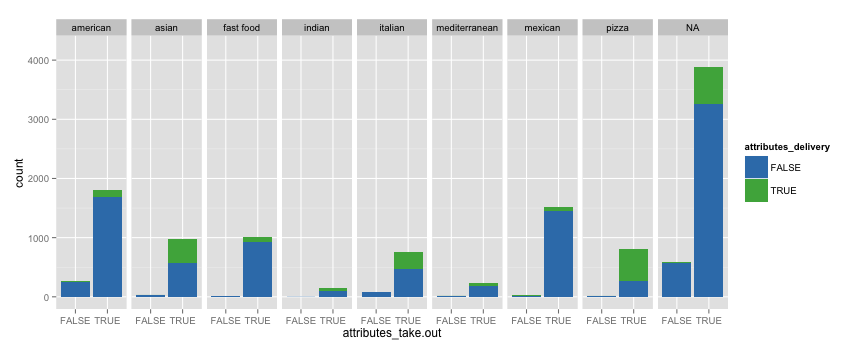
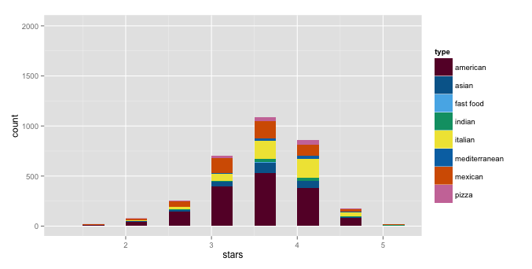
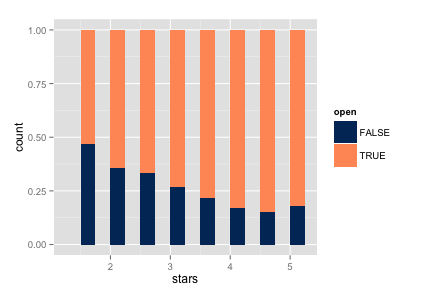
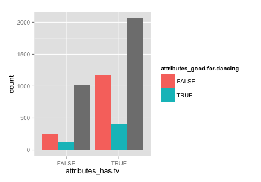
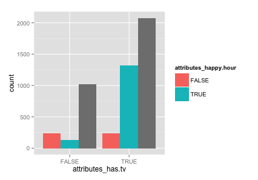

## Delivery vs. Takeout
- Most likely to deliver: 
    + Pizza
    + Asian food
- More likely to offer takeout

## Food in Bars
- American most common in all star levels
- All types of food prepresented

## Bar Status
- Are bars with lower ratings more likely to be closed?

## Bar Atmosphere
- Noise level
- Attire
- Style
    + Hipster
    + Divey
    + Casual
    + Etc.
- Good for groups
- Good for dancing
- Has a television
- Has happy hour specials

## Bar Atmosphere Cont.

- Has tv most likely not good for dancing
- Has tv most likely has happy hour specials

# Conclusion/Further Reseach

